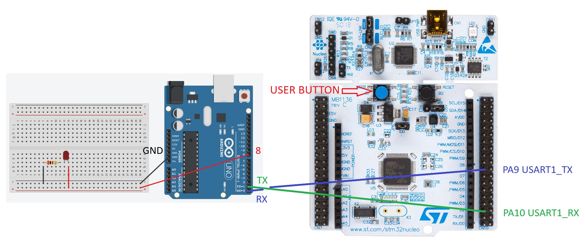
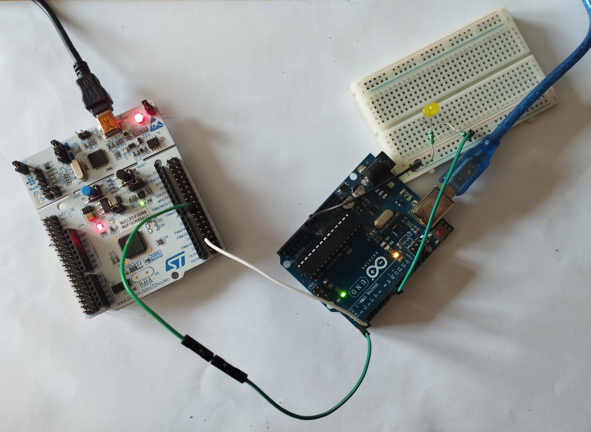
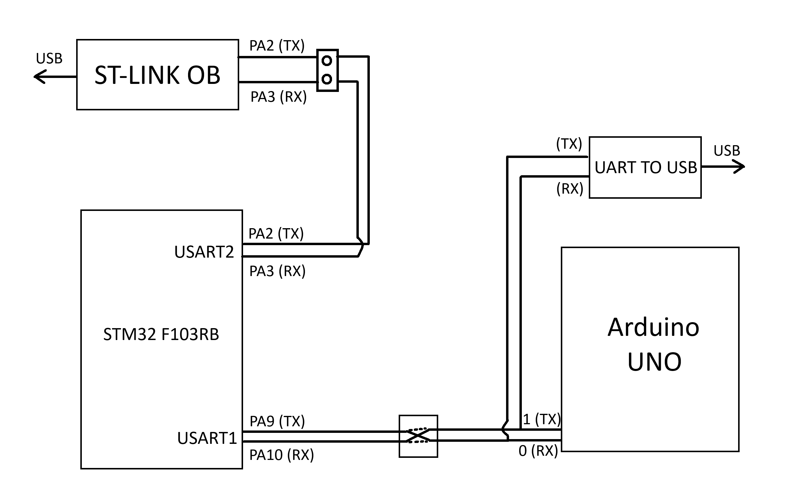
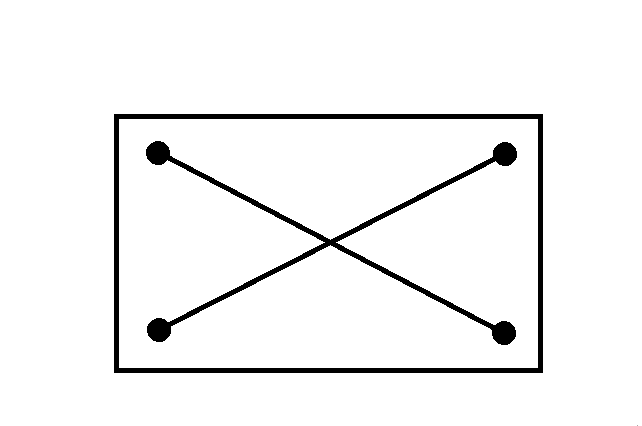
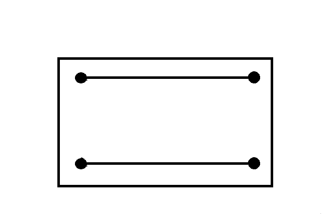

# STM32 Arduino UART

## Introduction
The aim of this report is to introduce working with the STM32 Nucleo board and the Arduino UNO, through theoretical notes and a practical example. The example will include these two devices as well as the UART protocol, which serves as the communication protocol between them.

## Assumptions
The assumptions in this document are that the user possesses basic knowledge of STM microcontrollers and is familiar with the process of programming them in the STM32CubeIDE development environment. The same assumption applies to the Arduino UNO and its development environment in the Arduino IDE. The final assumption is that the user has basic prior knowledge of how the UART protocol functions.

## Task Idea
In short, the idea of this task is to use the STM32 (blue) user button to toggle the light on and off on an LED connected to the Arduino UNO via a breadboard.

   
   

## UART
An important thing to note is that the Arduino UNO cannot simultaneously communicate with both the STM32 Nucleo and the computer. It has only one communication channel and is capable of communicating with only one device at a time during its operation. The diagram below should help illustrate this better:

   

<table border="0">
  <tr>
    <td><b style="font-size:30px">Configuration 1</b></td>
    <td><b style="font-size:30px">Configuration 2</b></td>
  </tr>
  <tr>
    <td>
      STM TX → Arduino RX and UART to USB TX
      <ul>
        <li>STM RX ← Arduino TX and UART to USB RX</li>
        <li>STM and UART to USB transmit, and Arduino receives</li>
        <li>Arduino transmits, and STM and UART to USB receive</li>
      </ul>
      Essentially, Arduino communicates with both, but STM and Arduino do not communicate with each other.
    </td>
    <td>
      STM TX → Arduino TX and UART to USB RX
      <ul>
        <li>STM RX ← Arduino RX and UART to USB TX</li>
        <li>STM and Arduino transmit, and UART to USB receives</li>
        <li>UART to USB transmits, STM and Arduino receive</li>
      </ul>
      In this configuration, Arduino communicates with both, but STM and UART to USB do not communicate with each other.
    </td>
  </tr>
  <tr>
    <td style='text-align:center; vertical-align:middle'>
      

        
      

    </td>
    <td style='text-align:center; vertical-align:middle'>
      

        
      

    </td>
  </tr>
</table>
