# STM32 Arduino UART

## Introduction
The aim of this report is to introduce working with the STM32 Nucleo board and the Arduino UNO, through theoretical notes and a practical example. The example will include these two devices as well as the UART protocol, which serves as the communication protocol between them.

## Assumptions
The assumptions in this document are that the user possesses basic knowledge of STM microcontrollers and is familiar with the process of programming them in the STM32CubeIDE development environment. The same assumption applies to the Arduino UNO and its development environment in the Arduino IDE. The final assumption is that the user has basic prior knowledge of how the UART protocol functions.

## Task Idea
In short, the idea of this task is to use the STM32 (blue) user button to toggle the light on and off on an LED connected to the Arduino UNO via a breadboard.

   
   

## UART
An important thing to note is that the Arduino UNO cannot simultaneously communicate with both the STM32 Nucleo and the computer. It has only one communication channel and is capable of communicating with only one device at a time during its operation. The diagram below should help illustrate this better:

   

<table border="0">
  <tr>
    <td><b style="font-size:30px">Configuration 1</b></td>
    <td><b style="font-size:30px">Configuration 2</b></td>
  </tr>
  <tr>
    <td>
      STM TX → Arduino RX and UART to USB TX
      <ul>
        <li>STM RX ← Arduino TX and UART to USB RX</li>
        <li>STM and UART to USB transmit, and Arduino receives</li>
        <li>Arduino transmits, and STM and UART to USB receive</li>
      </ul>
      Essentially, Arduino communicates with both, but STM and Arduino do not communicate with each other.
    </td>
    <td>
      STM TX → Arduino TX and UART to USB RX
      <ul>
        <li>STM RX ← Arduino RX and UART to USB TX</li>
        <li>STM and Arduino transmit, and UART to USB receives</li>
        <li>UART to USB transmits, STM and Arduino receive</li>
      </ul>
      In this configuration, Arduino communicates with both, but STM and UART to USB do not communicate with each other.
    </td>
  </tr>
  <tr>
    <td style='text-align:center; vertical-align:middle'>
      

        
      

    </td>
    <td style='text-align:center; vertical-align:middle'>
      

        
      

    </td>
  </tr>
</table>

<i>
  NOTE:
   
  It is important to mention that the STM32F103RB has 3 USART channels for communication. USART 1 and USART 3 are for communication with other devices, while USART 2 is exclusively for communication with the computer. This is precisely one of the reasons why, when we want to issue commands from the computer, we will always do so by configuring USART 2.
</i>

## Board Configuration

### Initial Setup

#### Generating Separate Files
First, for easier future work, we need to ensure that during the project build process, separate files are generated for the different functionalities of our STM board.

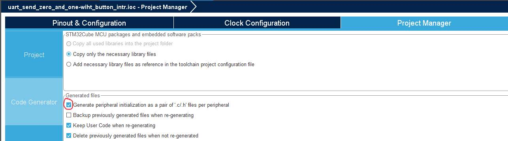 

#### Board Debugging
To enable debugging (and program execution), in the System Core header within the SYS section, you should select Serial Wire for the debug mode and SysTick for the time unit.

### STM32 Board Configuration

We configure pin PC13 to respond to the user push button press. Then, we configure pin PA5 to control the LD2 LED through it.

  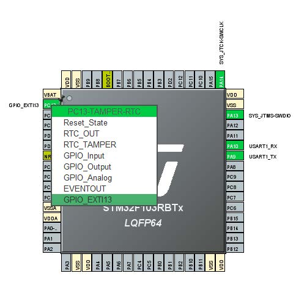
  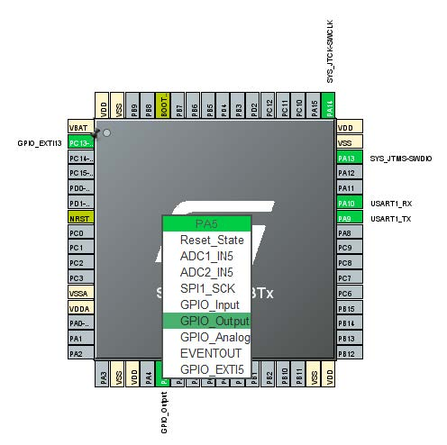 

Next, in the System Core header under the GPIO section, we configure these pins as shown in the images:

  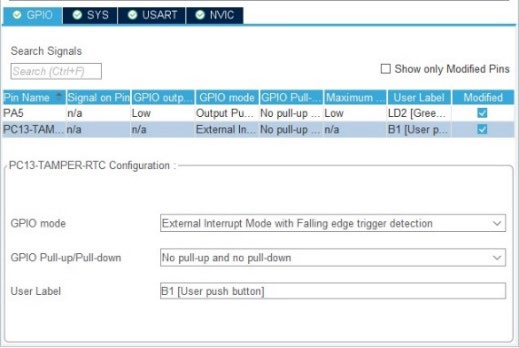
  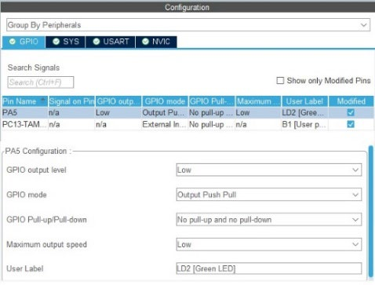 

It is important to note that you also need to enable the external interrupt, which will be necessary for our USART to function in Interrupt mode. This is enabled in the System Core header under the NVIC section.

  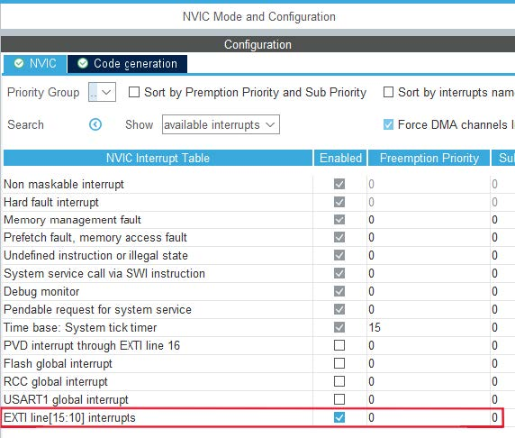 

### USART Setup
To communicate with the Arduino, it is necessary to configure USART1, which is located in the Connectivity header, with the following settings:

  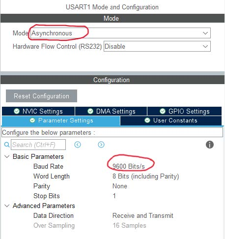 

## Settings After Configuration
### Headers and Necessary Variables
Since we are working with USART in <i>Interrupt mode</i>, it is sufficient for us to program within <i>Core/Src/gpio.c</i> (if we were working in <i>Polling mode</i>, we would need a <i>while</i> loop in <i>main.c</i>).

To start, we will include the file <i>usart.h</i>, which we need for USART, and two arrays:
<ul>
  <li><i>txdata</i> - which we will need for communication with the Arduino and</li>
  <li><i>set_reset</i> - which we will use to turn the LD2 LED on and off.</li>
</ul>
 

  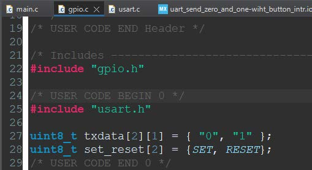 

### Searching for the Interrupt Callback Function

To find the appropriate callback function for the interrupt, we first need to check which handlers exist in the file located at Core/Src/system_32f1xx_it.c.

  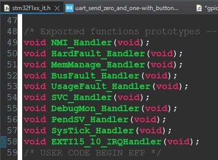 

Then, when we click on EXTI15_10_IRQHandler while holding CTRL + Left Mouse Button, we reach the following window.

  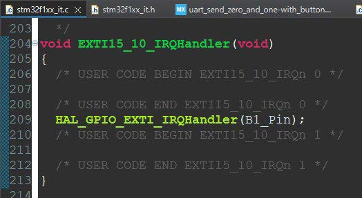 

If we click again with CTRL held down on the function HAL_GPIO_EXTI_IRQHandler, we will reach the next window.

  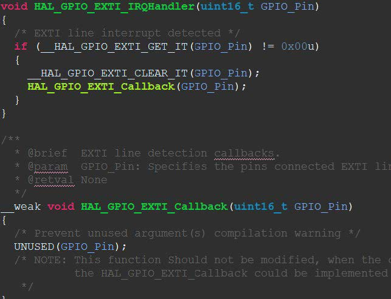 

Next, we copy the weak definition of the function HAL_GPIO_EXTI_Callback into our gpio.c file. There, we will write the following code as shown in the image. This code will alternately send messages to turn the LD2 LED on and off, sending "1" and "0" to the Arduino, where "1" will signal the LED to turn on and "0" to turn off.

  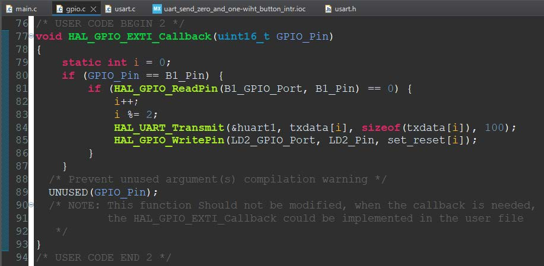 

